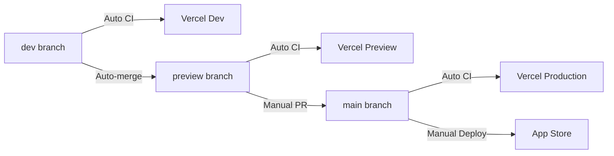

# GitHub Workflows

This directory contains GitHub Actions workflows for CI/CD automation.

## Branch Protection Rules Required

⚠️ **IMPORTANT**: Set up these branch protection rules in GitHub:

1. **All branches (dev, preview, main)**:
   - ✅ Require status checks to pass before merging
   - ✅ Require branches to be up to date before merging
   - **Required status checks**: `build-and-deploy`
   
2. **Preview and Main branches**:
   - ✅ Require pull request reviews before merging
   - ✅ Dismiss stale pull request approvals when new commits are pushed

This ensures Dependabot PRs must pass tests before auto-merging.

## Active Workflows

### 1. Main CI/CD Pipeline (`main.yml`)
- **Triggers**: Push to dev/preview/main, PRs
- **Purpose**: Primary CI/CD for web app
- **Features**:
  - Web app linting, testing, and building
  - Vercel deployments
  - Database migrations via Supabase
  - Auto-merge from dev → preview → main
  - Dependabot PR handling
- **Environment**: Uses Vercel for deployments

### 2. Deploy to Production (`deploy-production.yml`)
- **Triggers**: Manual (workflow_dispatch)
- **Purpose**: Deploy iOS app to App Store
- **Environment**: production (requires approval)
- **Inputs**:
  - Version number
  - Release notes
- **Actions**:
  - Updates version in Info.plist
  - Builds and uploads to App Store
  - Creates GitHub release

### 3. Promote Environment (`promote-environment.yml`)
- **Triggers**: Manual (workflow_dispatch)
- **Purpose**: Promote code between environments
- **Valid Paths**:
  - dev → preview
  - preview → main
- **Actions**:
  - Creates PR for promotion
  - Validates promotion path
  - Adds appropriate reviewers

### 4. iOS CI (`ios-ci.yml`)
- **Triggers**: Push/PR on iOS files
- **Purpose**: iOS testing and deployment
- **Features**:
  - SwiftLint checking
  - Unit tests
  - Memory leak detection
  - TestFlight deployment from preview branch
- **Environment**: Uses Xcode 15.4 (pinned)

### 5. Dependabot Auto-Merge (`dependabot-auto-merge.yml`)
- **Triggers**: Dependabot PRs + test completion
- **Purpose**: Safely automate dependency updates
- **Actions**:
  - Wait for tests to pass before merging
  - Auto-merge only minor and patch updates
  - Comment on major updates or test failures
  - Requires branch protection rules

## Deployment Flow

## Required Secrets

### Repository Secrets
- `GITHUB_TOKEN` (automatically provided)
- `VERCEL_TOKEN`
- `VERCEL_ORG_ID`
- `VERCEL_PROJECT_ID`
- `SUPABASE_DB_URL`
- `SUPABASE_ACCESS_TOKEN`
- `SUPABASE_PROJECT_ID`

### Environment Secrets (for iOS deployment)
- `APPLE_ID_EMAIL`
- `APPLE_ID_PASSWORD`
- `APPLE_TEAM_ID`
- `APP_STORE_APP_ID`
- `IOS_P12_BASE64`
- `IOS_P12_PASSWORD`
- `IOS_PROVISIONING_PROFILE_BASE64`
- `APP_STORE_CONNECT_API_KEY_ID` (production only)
- `APP_STORE_CONNECT_API_ISSUER_ID` (production only)
- `APP_STORE_CONNECT_API_KEY_BASE64` (production only)

## Usage Examples

### Deploy Web App
Automatically happens on push to any branch (dev/preview/main).

### Deploy iOS to TestFlight
1. Merge code to preview branch
2. iOS CI runs automatically via Fastlane
3. TestFlight deployment happens if iOS files changed

### Deploy iOS to App Store
1. Ensure code is merged to main branch
2. Go to Actions → Deploy to Production
3. Click "Run workflow"
4. Enter version (e.g., "1.2.3")
5. Enter release notes
6. Approve deployment in environment settings

### Promote Branches
1. Go to Actions → Promote Environment
2. Select source and target branches
3. Review and merge the created PR

## Troubleshooting

### Workflow Not Running?
- Check branch protection rules
- Verify workflow triggers match your branch/event
- Review Actions tab for disabled workflows

### Deployment Failed?
- Check workflow logs for specific errors
- Verify all required secrets are set
- Ensure environment approvals are configured

### Dependabot Not Auto-Merging?
- Check if update is minor/patch (major updates require manual review)
- Verify tests are passing
- Review branch protection rules