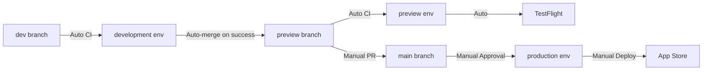

# GitHub Workflows

This directory contains GitHub Actions workflows for CI/CD automation.

## Workflows

### 1. CI/CD Pipeline (`ci.yml`)
- **Triggers**: Push to dev/preview/main, PRs
- **Purpose**: Run tests, linting, and builds
- **Environments**: Automatically uses development/preview/production based on branch
- **Jobs**:
  - Web lint, test, and build
  - iOS lint, test, and build
  - Auto-merge dev → preview on success
  - TestFlight deployment from preview branch

### 2. Deploy to Production (`deploy-production.yml`)
- **Triggers**: Manual (workflow_dispatch)
- **Purpose**: Deploy to App Store
- **Environment**: production (requires approval)
- **Inputs**:
  - Version number
  - Release notes
- **Actions**:
  - Updates version in Info.plist
  - Builds and uploads to App Store
  - Creates GitHub release

### 3. Promote Environment (`promote-environment.yml`)
- **Triggers**: Manual (workflow_dispatch)
- **Purpose**: Promote code between environments
- **Valid Paths**:
  - dev → preview
  - preview → main
- **Actions**:
  - Creates PR for promotion
  - Validates promotion path
  - Adds appropriate reviewers

## Environment Configuration

### Development
- **Branch**: `dev`
- **Auto-deploy**: Yes
- **Purpose**: Development builds and testing

### Preview
- **Branch**: `preview`
- **Auto-deploy**: Yes (TestFlight)
- **Purpose**: Beta testing

### Production
- **Branch**: `main`
- **Auto-deploy**: No (manual approval required)
- **Purpose**: App Store releases

## Required Secrets

### All Environments
- `NEXT_PUBLIC_SUPABASE_URL`
- `NEXT_PUBLIC_SUPABASE_ANON_KEY`
- `NEXT_PUBLIC_CLERK_PUBLISHABLE_KEY`

### Preview & Production Only
- `APPLE_ID_EMAIL`
- `APPLE_ID_PASSWORD`
- `APPLE_TEAM_ID`
- `APP_STORE_APP_ID`
- `IOS_P12_BASE64`
- `IOS_P12_PASSWORD`
- `IOS_PROVISIONING_PROFILE_BASE64`
- `IOS_PROVISIONING_PROFILE_NAME`

### Production Only
- `APP_STORE_CONNECT_API_KEY_ID`
- `APP_STORE_CONNECT_API_ISSUER_ID`
- `APP_STORE_CONNECT_API_KEY_BASE64`

## Deployment Flow

## Usage Examples

### Deploy to TestFlight
Automatically happens when code is pushed to `preview` branch.

### Deploy to App Store
1. Ensure code is merged to `main` branch
2. Go to Actions → Deploy to Production
3. Click "Run workflow"
4. Enter version (e.g., "1.2.3")
5. Enter release notes
6. Approve deployment in environment settings

### Promote dev to preview
1. Go to Actions → Promote Environment
2. Select source: `dev`, target: `preview`
3. Review and merge the created PR

## Troubleshooting

### CI Failing?
- Check which job failed in the workflow run
- Review logs for specific errors
- Ensure all secrets are properly configured
- Verify branch protection rules

### Environment Not Found?
- Ensure environments are created in repository settings
- Check environment names match exactly
- Verify secrets are added to correct environment

### Deployment Stuck?
- Check if environment requires approval
- Verify all required secrets are present
- Review deployment logs for errors